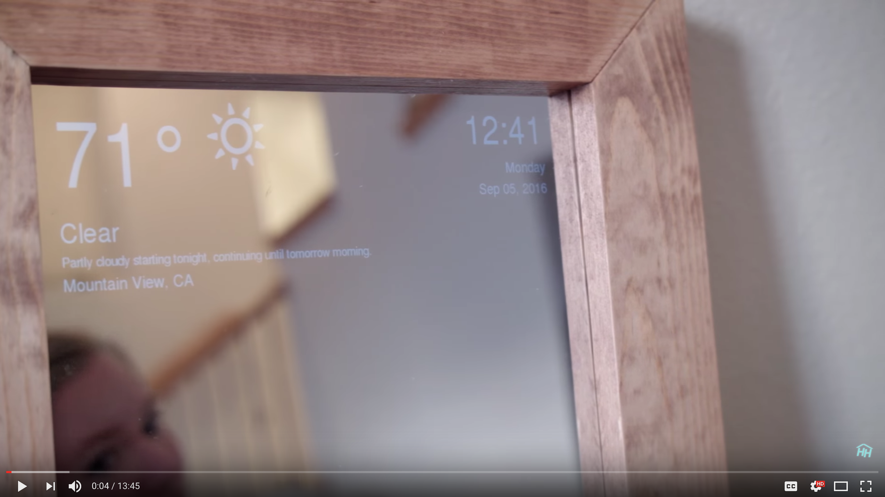

# Smart-Mirror
Espello con raspberry que pode mostrar o tempo, as novas e a hora.

## Instalación
## Code

> Si xa tes [git](https://git-scm.com/book/en/v2/Getting-Started-Installing-Git) instalado, clona o repositorio.

```
git clone https://github.com/IPardelo/smart-mirror.git
```

## Instalar as dependencias

> Si xa tes [pip](https://pip.pypa.io/en/stable/installing/) instalado...

```
sudo pip install -r requirements.txt
```

```
sudo apt-get install python-imaging-tk
```

## Running

Para executar o programa usa:
```
python smartmirror.py
```

## Liñas opcionais que substituír

* **Liña 30** valor de tamaño da temperatura.  
* **Liña 31**: valor de tamaño do reloxo.  
* **Liña 32**: valor de tamaño do título “Novas”.  
* **Liña 33**: valor de tamaño da data, previsión do tempo e novas.  
* **Liña 216**: trocamos “News” por “Novas”.  

## Vídeo e instruccións
[](https://youtu.be/fkVBAcvbrjU)