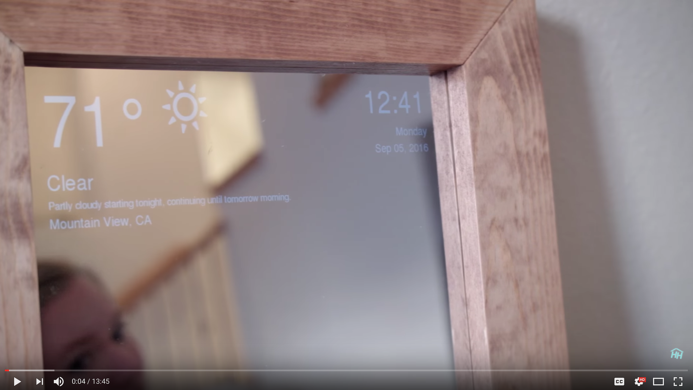

# Smart-Mirror

Espello con Raspberry Pi que mostra as noticias, o tempo e a hora.

## Requisitos

- **Raspberry Pi**.
- **Python 3**, **Python3-tk**, **Python3-venv**.
- Conexión a Internet (tempo e novas).

## Instalación

Clona o repositorio na Raspberry Pi:

```bash
git clone https://github.com/IPardelo/smart-mirror.git
cd smart-mirror
python3 install.py
sudo reboot
```

O script `install.py` instala dependencias do sistema, o **locale galego** (`gl_ES.UTF-8`), crea o `.venv` e configura o **arranque automático** (`run-mirror.sh`) en pantalla completa.

## Execución

Co venv activado:

```bash
cd ~/smart-mirror
source .venv/bin/activate
python smartmirror.py
```

Sen activar o venv, ou co arranque automático (recomendado ao encender):

```bash
~/smart-mirror/run-mirror.sh
```

Atallos de teclado:

- **Enter**: activar/desactivar pantalla completa
- **Escape**: saír da pantalla completa

## Configuración

Abre `smartmirror.py` e axusta as variables no inicio do ficheiro.

### Tempo — MeteoGalicia

O espello usa a **API MeteoSIX v5 de MeteoGalicia** (predición oficial da Xunta de Galicia, modelo WRF). É a fonte máis precisa para Galicia.

**Documentación oficial:** [MeteoSIX — MeteoGalicia](https://www.meteogalicia.gal/web/modelos-numericos/meteosix)  
Nesa páxina atoparás o manual da API (versión v5), o formulario para solicitar a clave e exemplos de uso. O código segue as operacións `/getNumericForecastInfo` e `/getSolarInfo` descritas no manual.

```python
meteogalicia_api_key = 'A_TUA_CLAVE'
```

| Variable | Descrición |
|----------|------------|
| `meteogalicia_api_key` | Clave MeteoSIX (obrigatoria) |
| `latitude` / `longitude` | Coordenadas do lugar en Galicia |
| `location_name` | Nome do lugar (opcional; se está baleiro, dedúcese polas coordenadas) |
| `weather_lang` | Idioma dos textos do tempo (`'gl'` por defecto; `'es'` para castelán) |
| `weather_unit` | `'metric'` (°C) ou `'imperial'` (°F) |

> O servizo só cubre coordenadas dentro de **Galicia**.

### Ubicación

```python
latitude = '43.10472'
longitude = '-9.21806'
location_name = 'Muxía'  # opcional, p.ex. 'Muxía'
```

### Reloxo e interface

| Variable | Descrición |
|----------|------------|
| `date_format` | Formato da data (ex.: `"%d %b, %Y"`) |
| `ui_locale` | Locale do reloxo/data (`'gl_ES.utf8'`; ver [Locale galego](#locale-galego-gl_es)) |
| `start_fullscreen` | `True` para abrir en pantalla completa ao arrancar |
| `xlarge_text_size` | Tamaño da temperatura |
| `large_text_size` | Tamaño da hora |
| `medium_text_size` | Tamaño de títulos |
| `small_text_size` | Tamaño de data, previsión e noticias |

### Noticias

Os titulares provén de varios periódicos por RSS e móstranse **intercalados** (unha noticia de cada medio por turno). O idioma dos titulares depende de cada medio (p.ex. La Voz de Galicia en galego; outros feeds poden estar en castelán). Para máis contido en galego, escolle feeds en galego en `news_feeds`.

| Variable | Descrición |
|----------|------------|
| `news_feeds` | Lista de pares `(nome, url_rss)` — un feed por periódico |
| `news_headlines_per_feed` | Cantidade de titulares a ler de cada feed |
| `news_headlines_total` | Máximo de titulares na pantalla |

Exemplo (engade ou quita medios segundo prefiras):

```python
news_feeds = [
    ('Galicia', 'http://ep00.epimg.net/rss/ccaa/galicia.xml'),
    ('20minutos', 'https://www.20minutos.es/rss/'),
]
news_headlines_per_feed = 3
news_headlines_total = 6
```

Cada liña amosa o nome do medio, por exemplo: `20minutos · Título da noticia`.

## Dependencias

- [requests](https://pypi.org/project/requests/) — API MeteoGalicia
- [feedparser](https://pypi.org/project/feedparser/) — RSS de noticias
- [Pillow](https://pypi.org/project/Pillow/) — iconos do tempo

## Vídeo e instrucións orixinais

[](https://youtu.be/fkVBAcvbrjU)
